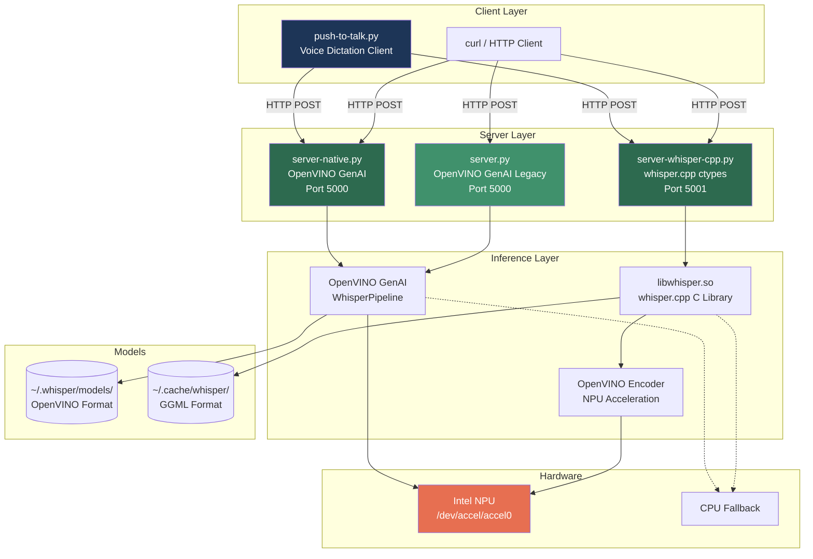
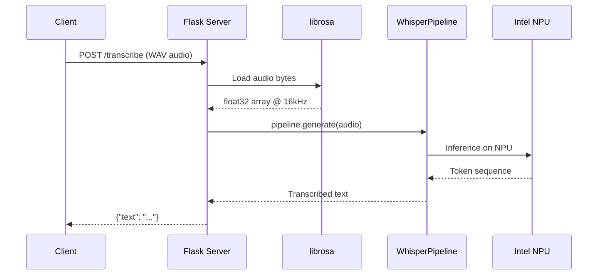
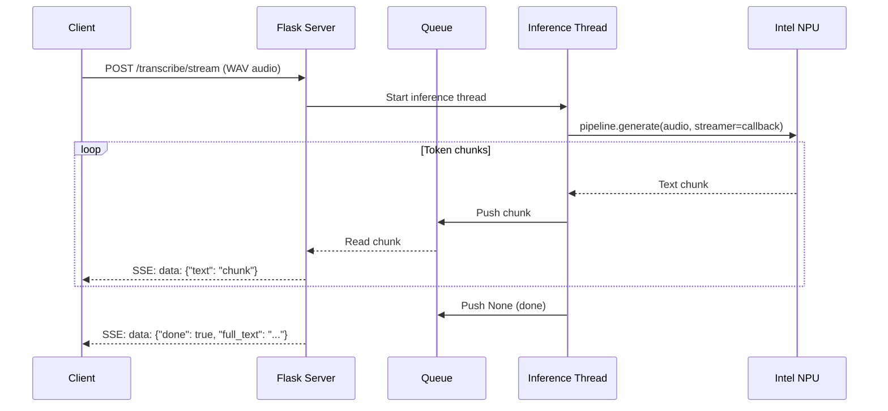
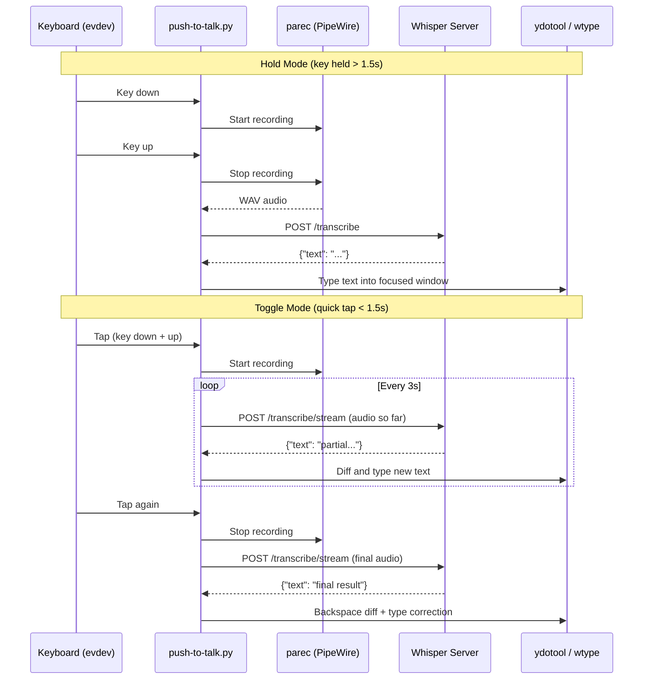
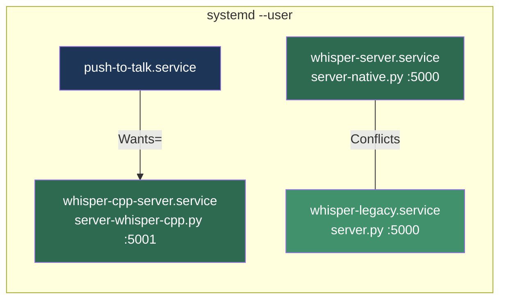

# Whisper NPU Server

Local speech-to-text transcription server accelerated by Intel NPU hardware via OpenVINO. Includes a push-to-talk voice dictation client for Wayland desktops.

## Quick Start

```bash
git clone git@github.com:dmzoneill/whisper-npu-wayland.git
cd whisper-npu-wayland
make install        # installs deps, system packages, default model, services, permissions
make start          # starts whisper-server, whisper-cpp-server, push-to-talk
make status         # check service status
make test           # hit health/model endpoints
```

That's it. `make install` downloads the default model (`whisper-small.en-fp16-ov`) automatically. See [Models](#models) below for installing additional models.

## Usage Examples

### Transcribe an audio file

```bash
curl -X POST http://127.0.0.1:5000/transcribe --data-binary @recording.wav
# {"text": "This is the transcribed text."}
```

### Stream transcription (real-time chunks via SSE)

```bash
curl -N -X POST http://127.0.0.1:5000/transcribe/stream --data-binary @recording.wav
# data: {"text": "This is "}
# data: {"text": "the transcribed "}
# data: {"text": "text."}
# data: {"done": true, "full_text": "This is the transcribed text."}
```

### Use a specific model

```bash
curl http://127.0.0.1:5000/models
# {"models": ["whisper-small.en-fp16-ov", "whisper-base.en"]}

curl -X POST http://127.0.0.1:5000/transcribe/whisper-base.en --data-binary @recording.wav
```

### Voice dictation (push-to-talk)

The push-to-talk service starts automatically. By default it uses Right Ctrl:

- **Hold** Right Ctrl for >1.5s — records while held, transcribes on release, types into the focused window
- **Tap** Right Ctrl quickly — starts recording with live streaming, tap again to stop

Check its logs with `make logs-ptt`.

## Architecture



## Data Flow

### Batch Transcription



### Streaming Transcription (server-native.py)



### Push-to-Talk Voice Dictation



## Servers

### server-native.py (Primary)

OpenVINO GenAI server with batch and streaming transcription.

| Endpoint | Method | Description |
|----------|--------|-------------|
| `/models` | GET | List available models |
| `/transcribe` | POST | Batch transcription (default model) |
| `/transcribe/<model>` | POST | Batch transcription (named model) |
| `/transcribe/stream` | POST | SSE streaming transcription (default model) |
| `/transcribe/stream/<model>` | POST | SSE streaming transcription (named model) |

Environment variables:
- `WHISPER_DEVICE` — inference device: `NPU`, `CPU`, `GPU` (default: `NPU`)
- `WHISPER_MODEL` — default model name (default: `whisper-small.en-fp16-ov`)

Models are loaded from `~/.whisper/models/` in OpenVINO format.

### server.py (Legacy)

Minimal OpenVINO GenAI server. Same endpoints as server-native.py minus streaming. Hardcoded to NPU device with `whisper-small` as default model.

### server-whisper-cpp.py

Whisper.cpp server using ctypes bindings to `libwhisper.so`. Supports optional OpenVINO encoder acceleration on NPU.

| Endpoint | Method | Description |
|----------|--------|-------------|
| `/transcribe` | POST | Batch transcription |
| `/transcribe/stream` | POST | Transcribe last 30s of audio |
| `/health` | GET | Health check |

```
python3 server-whisper-cpp.py --port 5001 --model ~/.cache/whisper/ggml-base.bin --device NPU
```

Models are GGML format stored in `~/.cache/whisper/`. If an OpenVINO encoder XML file exists alongside the model (`*-encoder-openvino.xml`), it is loaded for NPU acceleration; otherwise inference falls back to CPU.

## Push-to-Talk Client

Desktop voice dictation client for GNOME/Wayland. Listens for a hotkey via evdev, records audio through PipeWire, sends it to a whisper server, and types the result into the focused window.

```
python3 push-to-talk.py --key KEY_RIGHTCTRL --backend whisper-cpp --stream-interval 3.0
```

**Two modes of operation:**

- **Hold mode** — hold the key for >1.5 seconds. Audio is recorded while held, transcribed on release, and typed as a single block.
- **Toggle mode** — quick tap (<1.5s). Recording starts immediately with live incremental transcription every few seconds. Tap again to finalize. Uses a diff algorithm to backspace and retype only the changed suffix when the model corrects earlier words.

**Typing backends** (tried in order on Wayland): `ydotool` → `wtype` → `wl-copy` (clipboard fallback). On X11: `xdotool`.

## Service Architecture



`whisper-server` and `whisper-legacy` both bind port 5000 — systemd `Conflicts=` ensures only one runs at a time. `push-to-talk` depends on `whisper-cpp-server` by default.

## Installation

### Prerequisites

- Linux (Fedora) with Intel Core Ultra processor (NPU)
- Device access: `/dev/accel/accel0` (NPU), `/dev/dri` (GPU)
- Python 3

### Quick Start

```bash
make install     # Install everything: Python deps, system packages, permissions, services
make start       # Start whisper-server, whisper-cpp-server, and push-to-talk
make status      # Check service status
make test        # Health check against running servers
```

### What `make install` Does

1. **Python packages** — installs from `requirements.txt` plus `aiohttp` and `evdev`
2. **System packages** — `ydotool`, `pipewire-pulseaudio`, `wtype`, `wl-clipboard`, `xdotool`
3. **Permissions** — adds your user to the `input` group (for evdev keyboard access)
4. **Default model** — downloads `whisper-small.en-fp16-ov` from HuggingFace if not already present
5. **Services** — generates and installs four systemd user service files
6. **Enable** — enables the three main services to start on login

### Makefile Targets

| Target | Description |
|--------|-------------|
| `make install` | Full install: deps + model + services + permissions |
| `make install-models` | Download the default OpenVINO model |
| `make start` | Start all services |
| `make stop` | Stop all services |
| `make restart` | Restart all services |
| `make status` | Show service and ydotoold status |
| `make logs` | Show recent logs for all services |
| `make test` | Curl health checks |
| `make uninstall` | Stop, disable, and remove services |
| `make clean` | Remove downloaded models (prompts first) |

### Configuration

Override defaults at install time:

```bash
make install WHISPER_DEVICE=CPU WHISPER_MODEL=whisper-base.en WHISPER_CPP_PORT=5002
```

| Variable | Default | Description |
|----------|---------|-------------|
| `WHISPER_DEVICE` | `NPU` | OpenVINO device for server-native |
| `WHISPER_MODEL` | `whisper-small.en-fp16-ov` | Default model for server-native |
| `WHISPER_CPP_DEVICE` | `NPU` | OpenVINO device for whisper.cpp |
| `WHISPER_CPP_PORT` | `5001` | Port for whisper.cpp server |

## Models

### OpenVINO Models (for server.py / server-native.py)

Stored in `~/.whisper/models/`. Download from HuggingFace:

```bash
cd ~/.whisper/models
for model in whisper-small.en-fp16-ov whisper-base.en whisper-tiny.en; do
    GIT_LFS_SKIP_SMUDGE=1 git clone https://huggingface.co/mecattaf/$model
    cd $model && git lfs pull && cd ..
done
```

Available models: `whisper-tiny`, `whisper-base`, `whisper-small`, `whisper-medium`, `whisper-large-v3` (and `.en` variants).

### GGML Models (for server-whisper-cpp.py)

Stored in `~/.cache/whisper/`. Download:

```bash
mkdir -p ~/.cache/whisper
curl -L -o ~/.cache/whisper/ggml-base.bin \
    https://huggingface.co/ggerganov/whisper.cpp/resolve/main/ggml-base.bin
```

## API Usage

### Batch Transcription

```bash
curl -X POST http://127.0.0.1:5000/transcribe \
    --data-binary @audio.wav
```

```json
{"text": "The transcribed text appears here."}
```

### Streaming Transcription (SSE)

```bash
curl -N -X POST http://127.0.0.1:5000/transcribe/stream \
    --data-binary @audio.wav
```

```
data: {"text": "The "}
data: {"text": "transcribed "}
data: {"text": "text "}
data: {"done": true, "full_text": "The transcribed text appears here."}
```

### List Models

```bash
curl http://127.0.0.1:5000/models
```

```json
{"models": ["whisper-small.en-fp16-ov", "whisper-base.en"]}
```

### Health Check (whisper.cpp)

```bash
curl http://127.0.0.1:5001/health
```

```json
{"status": "ok", "backend": "whisper.cpp", "model": "/home/user/.cache/whisper/ggml-base.bin"}
```

## Dependencies

### Python

| Package | Version | Used By |
|---------|---------|---------|
| openvino | >= 2024.5.0 | server.py, server-native.py |
| openvino-genai | >= 2024.5.0 | server.py, server-native.py |
| openvino-tokenizers | >= 2024.5.0 | server.py, server-native.py |
| librosa | 0.10.2.post1 | All servers |
| flask | 3.1.0 | All servers |
| aiohttp | latest | push-to-talk.py |
| evdev | latest | push-to-talk.py |

### System

| Package | Purpose |
|---------|---------|
| `ydotool` | Type text into focused window (Wayland) |
| `wtype` | Fallback Wayland text input |
| `wl-clipboard` | Clipboard fallback (`wl-copy`) |
| `xdotool` | X11 text input fallback |
| `pipewire-pulseaudio` | Audio recording via `parec` |

### Native Libraries

| Library | Used By |
|---------|---------|
| `libwhisper.so` | server-whisper-cpp.py (ctypes) |
| OpenVINO runtime | Both backends |

## Hardware

Tested on Lenovo ThinkPad P1 Gen 7 with Intel Core Ultra 7 165H (Meteor Lake NPU).

Required device files:
- `/dev/accel/accel0` — Intel NPU
- `/dev/dri` — DRI (GPU, optional)
